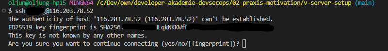
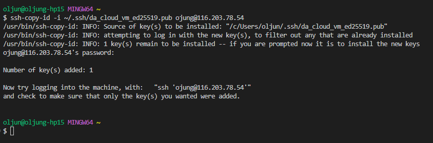
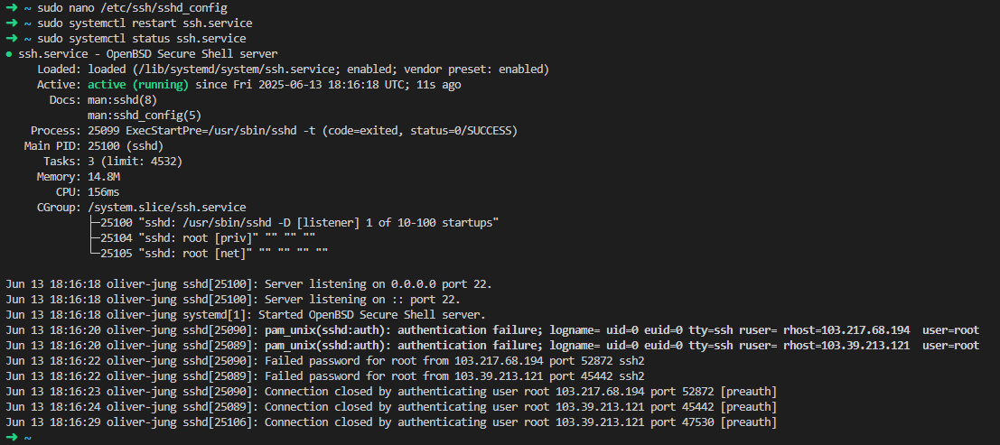

# V-Server setup

<!-- TOC depthfrom:2 depthto:6 -->

- [Description assignment](#description-assignment)
- [First login to the server and setting up an SSH key](#first-login-to-the-server-and-setting-up-an-ssh-key)
  - [Test login on the server](#test-login-on-the-server)
  - [Generate a ssh key and deposit it on the server](#generate-a-ssh-key-and-deposit-it-on-the-server)
    - [ssh key generation](#ssh-key-generation)
    - [Copy ssh key to VM-Server](#copy-ssh-key-to-vm-server)
- [Deactivate password login](#deactivate-password-login)

<!-- /TOC -->
## Description assignment

This readme file describes how the project task ‘V-Server-Setup’ is solved as part of the DevSecOps course of the Developer Academy.

## First login to the server and setting up an SSH key

### Test login on the server

To test the login on the server, try to log on to the server via ssh with username and password. Open a command line such as `cmd` or `git-bash`. Use the following command to establish a connection to your server:

```bash
ssh <your_username>@<your_ip>
```

Replace `<your_username>` and `<your_ip>` with your actual login data, e.g.:

```bash
ssh jdoe@555.555.555.555
```

For the first time of login you will see a message, that you are unknown for the server. You have to "create" a
fingerprint on the server:



Type `yes` in the command shell.

After this you have to authenticate with your password. Now you should see something like this in your command shell:


Congratulations, you are logged in! Please open a new local terminal or logout from the server with:

```bash
logout
```

### Generate a ssh key and deposit it on the server

#### ssh key generation

> [!WARNING]
> To generate a ssh key use a new command line on your <ins>**local machine**</ins>

```bash
ssh-keygen -t ed25519
```

The system will ask you under which file path the new ssh key should be saved. You can also secure the key with a password. If you want to do this, make sure that you keep this password safe. If you want to use a small password, simply confirm with the `Enter` key

After creating your key, you will see the following in the shell.


#### Copy ssh key to VM-Server

To copy the generated ssh to your VM use the following command. Make sure you are on your local machine command line:

```bash
# ssh-copy-id -i <path/to/your/key> <user>@<host>

ssh-copy-id -i ~/.ssh/da_cloud_vm_ed25519.pub ojung@116.203.78.54
```

You have to confirm this action by entering your password für the virtual machine again. After this you will the the
following output in the terminal.



Now, you can login to the cloud machine:

```bash
# ssh -i <~/path/to/key> <user@host>

ssh -i ~/.ssh/da_cloud_vm_ed25519 ojung@116.203.78.54
```

## Deactivate password login

For security reasons, it is advisable to deactivate the password login on the VM. For example, a password can be cracked
using a brute force attack.

Make sure, you are logged in to the VM-Server. now editing the ssh config file. To edit this config file administration
right on the VM are needed, so we need a `sudo`in front of the command:

```bash
sudo nano /etc/ssh/sshd_config
```

The nano editor is opened, now change this line:

`#PasswordAuthentication yes`

to

`PasswordAuthentication no`

To save the file use `CTRL+S` and close it with `CTRL+X`

Restart the ssh service with:

`sudo systemctl restart ssh.service`

You can check if the ssh service is running with:

`sudo systemctl status ssh.service`

The answer from the server should look like this:



You can check if the login with a password is possible with the command:

```bash
# ssh -o PubkeyAuthentication=no <user>@<host>

ssh -o PubkeyAuthentication=no ojung@116.203.78.54
```

You see something like this?


Perfect, this is exactly what we want.
