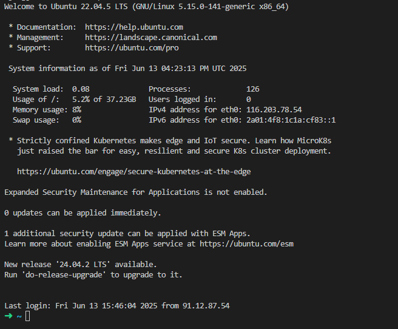
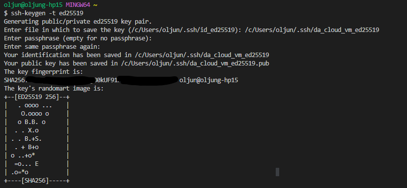
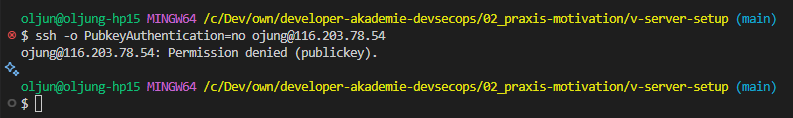
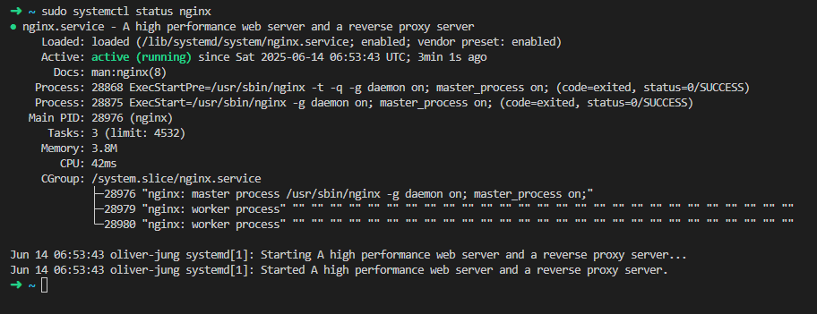
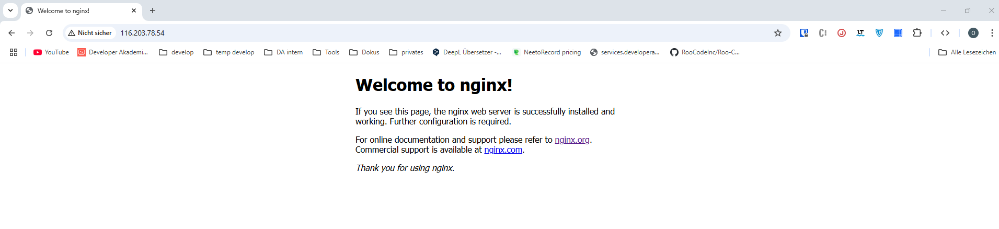
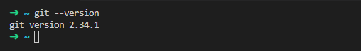
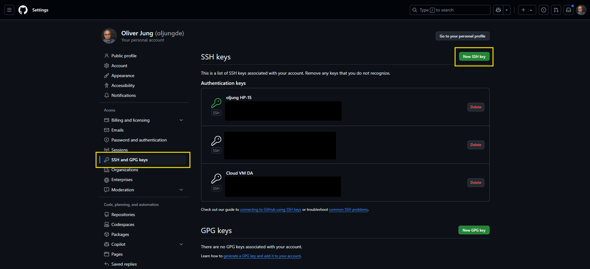

# V-Server setup

<!-- TOC depthfrom:2 depthto:6 -->

- [Description assignment](#description-assignment)
- [First login to the server and setting up an SSH key](#first-login-to-the-server-and-setting-up-an-ssh-key)
  - [Test login on the server](#test-login-on-the-server)
  - [Generate a ssh key and deposit it on the server](#generate-a-ssh-key-and-deposit-it-on-the-server)
    - [ssh key generation](#ssh-key-generation)
    - [Copy ssh key to VM-Server](#copy-ssh-key-to-vm-server)
- [Deactivate password login](#deactivate-password-login)
- [Webserver configuration with nginx](#webserver-configuration-with-nginx)
  - [Install nginx](#install-nginx)
  - [Alternative nginx configuration](#alternative-nginx-configuration)
- [Git setup](#git-setup)

<!-- /TOC -->
## Description assignment

This readme file describes how the project task ‘V-Server-Setup’ is solved as part of the DevSecOps course of the Developer Akademie.

---

## First login to the server and setting up an SSH key

### Test login on the server

- To test the login on the server, try to log on to the server via ssh with username and password. Open a command line such as `cmd` or `git-bash`. Use the following command to establish a connection to your server:

  ```bash
  ssh <your_username>@<your_ip>
  ```

  Replace `<your_username>` and `<your_ip>` with your actual login data, e.g.:

  ```bash
  ssh jdoe@555.555.555.555
  ```

- For the first time of login you will see a message, that you are unknown for the server. You have to "create" a
fingerprint on the server:

  

- Type `yes` in the command shell.

- After this you have to authenticate with your password. Now you should see something like this in your command shell:

  

- Congratulations, you are logged in! Please open a new local terminal or logout from the server with:

  ```bash
  logout
  ```

### Generate a ssh key and deposit it on the server

#### ssh key generation

> [!WARNING]
> To generate a ssh key use a new command line on your <ins>**local machine**</ins>

```bash
ssh-keygen -t ed25519
```

The system will ask you under which file path the new ssh key should be saved. You can also secure the key with a password. If you want to do this, make sure that you keep this password safe. If you want to use a small password, simply confirm with the `Enter` key

- After creating your key, you will see the following in the shell.

  

#### Copy ssh key to VM-Server

- To copy the generated ssh to your VM use the following command. Make sure you are on your local machine command line:

  ```bash
  # ssh-copy-id -i <path/to/your/key> <user>@<host>

  ssh-copy-id -i ~/.ssh/da_cloud_vm_ed25519.pub ojung@116.203.78.54
  ```

- You have to confirm this action by entering your password für the virtual machine again. After this you will the the
following output in the terminal.

  

- Now, you can login to the cloud machine:

  ```bash
  # ssh -i <~/path/to/key> <user@host>

  ssh -i ~/.ssh/da_cloud_vm_ed25519 ojung@116.203.78.54
  ```

---

## Deactivate password login

For security reasons, it is advisable to deactivate the password login on the VM. For example, a password can be cracked
using a brute force attack.

- Make sure, you are logged in to the VM-Server. now editing the ssh config file. To edit this config file administration
right on the VM are needed, so we need a `sudo`in front of the command:

  ```bash
  sudo nano /etc/ssh/sshd_config
  ```

- The nano editor is opened, now change this line:

  `#PasswordAuthentication yes`

  to

  `PasswordAuthentication no`

- To save the file use `CTRL+S` and close it with `CTRL+X`

- Restart the ssh service with:

  `sudo systemctl restart ssh.service`

- You can check if the ssh service is running with:

  `sudo systemctl status ssh.service`

- The answer from the server should look like this:

  

- You can check if the login with a password is possible with the command:

  ```bash
  # ssh -o PubkeyAuthentication=no <user>@<host>

  ssh -o PubkeyAuthentication=no ojung@116.203.78.54
  ```

You see something like this?



Perfect, this is exactly what we want.

---

## Webserver configuration with nginx

A web server delivers static or dynamic files, for example for a web application or a website. nginx is used for this
server, another option would be Apache, for example.

### Install nginx

- To use the VM as a Webserver it is needed to install nginx. First it is recommended to update the installed packages on
the VM. Use:

  ```bash
  sudo apt update
  ```

- Install nginx with:

  ```bash
  sudo apt install nginx -y
  ```

- You can then check whether nginx is now running:

  ```bash
  sudo systemctl status nginx.service
  ```

- You should see an output in your command line like this:

  

- Now it is possible to check if the web server is running as expectet. Open your browser and enter the IP address of your
Server, e.g. `116.203.78.54`. You the a website like this?

  

### Alternative nginx configuration

- To see the code of the nginx start page, it is possible zo use the `cat` command on the VM:

  ```bash
  sudo cat /var/www/html/index.nginx-debian.html
  ```

- Now the HTML code of the page is displayed in the command line:

  

- Create a new folder for the alternative start page:

  ```bash
  sudo mkdir /var/www/html/web
  ```

- Create a new empty HTML file. This page wird the new start page for our nginx setup.

  ```bash
  sudo touch /var/www/html/web/alternate-index.html
  ```

- Edit the HTML code of this page with `nano`

  ```bash
  sudo nano /var/www/html/web/alternate-index.html
  ```

  After the edit the code could lock like this:

  

- Save the file with `CTRL+S` and leave the editor with `CTRL+X`

- Add a new nginx configuration for the enabled sites

  ```bash
  sudo nano /etc/nginx/sites-enabled/web
  ```

  Enter the following to this file:

  ```bash
  server {
        listen 8081;
        listen [::]:8081;

        root /var/www/http/alternatives;
        index alternate-index.html;

        location / {
                try_files $uri $uri/ =404;
        }
  }
  ```

- Restart the nginx service with:

  `sudo service nginx restart`

- Check if the service is restarted an is running with:

  `sudo systemctl status nginx.service`

- If it is desired that the old nginx start page is no longer accessible, it is possible to set up a port forwarding
for the default nginx configuration.

  - Open the default nginx configuration with:

  ```bash
  sudo nano /etc/nginx/sites-enabled/default
  ```

  - Lock for the `location` entry and add these lines:

  ```bash
  # Port forwarding to 8081
  proxy_pass http://127.0.0.1:8081
  ```

  - Your file should lock like this:

  ```bash

  # ... some comments and commented out settings above
  server {
          listen 80 default_server;
          listen [::]:80 default_server;

          # SSL configuration
          #
          # listen 443 ssl default_server;
          # listen [::]:443 ssl default_server;
          #
          # Note: You should disable gzip for SSL traffic.
          # See: https://bugs.debian.org/773332
          #
          # Read up on ssl_ciphers to ensure a secure configuration.
          # See: https://bugs.debian.org/765782
          #
          # Self signed certs generated by the ssl-cert package
          # Don't use them in a production server!
          #
          # include snippets/snakeoil.conf;

          root /var/www/html;

          # Add index.php to the list if you are using PHP
          index index.html index.htm index.nginx-debian.html;

          server_name _;

          location / {
                  # Port forwarding to 8081
                  proxy_pass http://127.0.0.1:8081/;
                  # First attempt to serve request as file, then
                  # as directory, then fall back to displaying a 404.
                  try_files $uri $uri/ =404;
          }

          # ... some more comments and commented out settings below
  }
  ```

---

## Git setup

- Check if git is installed on the server with `git --version`. You should see something like this in your terminal:

  

- Create a new ssh key on the VM server:

  ```bash
  ssh-keygen -t ed25519
  ```

  Confirm the save path and file name or adjust it according to your wishes. You can also assign a password if you wish. This process
  has already been described above when the ssh key was created for the local machine.

- Open the public ssh key an copy it with `sudo cat ~/.ssh/<your_file_name>.pub`

  > [!WARNING]
  > For security reasons, always use the file with the `.pub` file extension

- Store the ssh key in your github account under `Settings/SSH and GPG keys`

  

  Now it is possible to work with git on the VM-Server.

  ---

## Publication of this documentation as a website [Additional configuration (optional)]

- Create new folder `vm-setup` inside the `web` folder

  ```bash
  sudo mkdir /var/www/html/web/vm-setup
  ```

- Navigate to this folder with `cd /var/www/html/web/vm-setup`

- Clone the repository into this folder:

  ```bash
  sudo git clone https://github.com/oljungde/v-server-setup.git .
  ```

- Edit the nginx configuration for web

  ```bash
  sudo nano /etc/nginx/sites-enabled/web
  ```

  - Change the file content to:

    ```bash
    server {
      listen 80;
      listen [::]:80;

      server_name _;

      location / {
          proxy_pass http://127.0.0.1:8081;

          proxy_set_header Host $host;
          proxy_set_header X-Real-IP $remote_addr;
          proxy_set_header X-Forwarded-For $proxy_add_x_forwarded_for;
          proxy_set_header X-Forwarded-Proto $scheme;
      }
    }

    server {
      listen 8081;
      listen [::]:8081;

      root /var/www/html/web;
      index alternate-index.html index.html;

      location / {
          try_files $uri $uri/ =404;
      }
    }
    ```

    - The first server block serves as a reverse proxy and ensures that all requests arriving at port 80 are forwarded to
  port 8081.

    - The second server block is the actual web server configuration, which can be accessed via the proxy.

- Delete the default nginx configuration, otherwise our site would still not be accessible

  ```bash
  sudo rm /etc/nginx/sites-enabled/default
  ```

- Restart the nginx service with `sudo systemctl restart nginx.service`

- The modified "nginx homepage" is now available at `http://16.203.78.54` and this documentation is available as a
website at `http://16.203.78.54/vm-setup`
